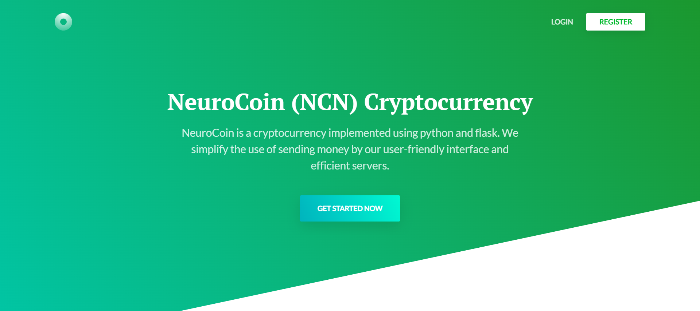
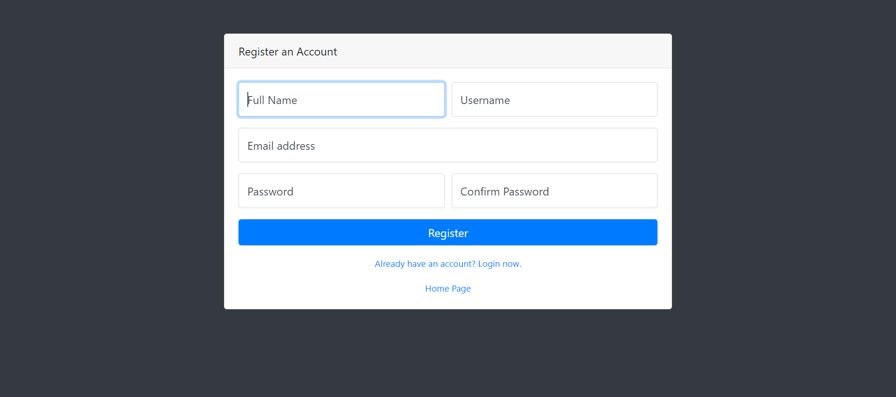
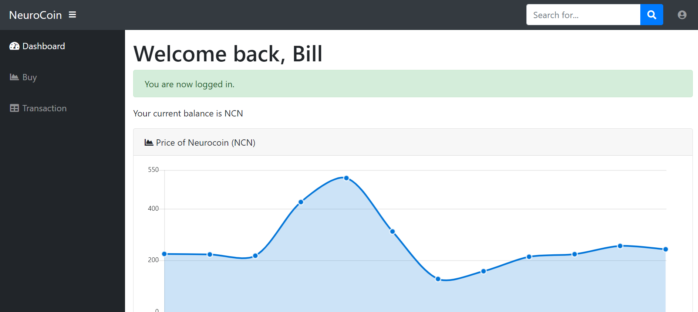
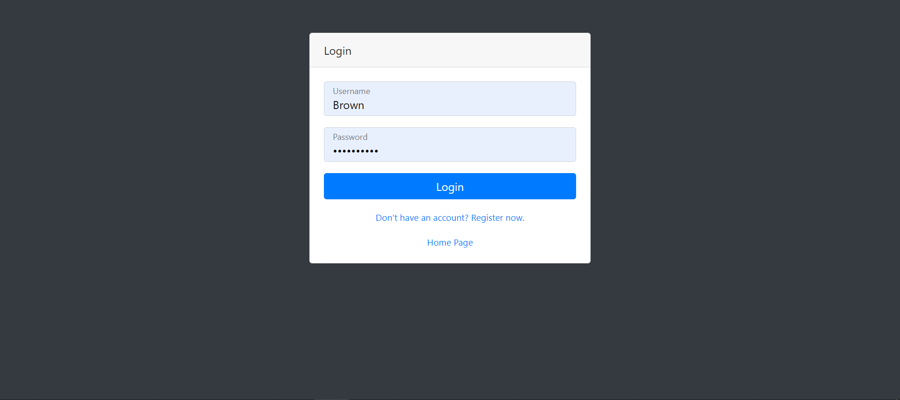
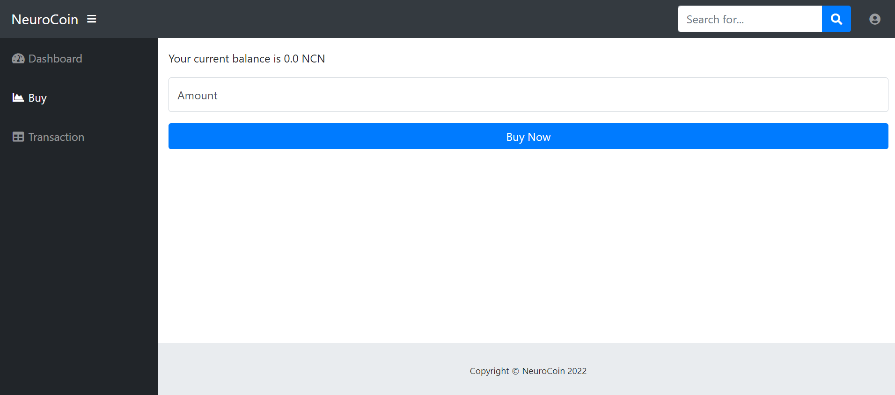
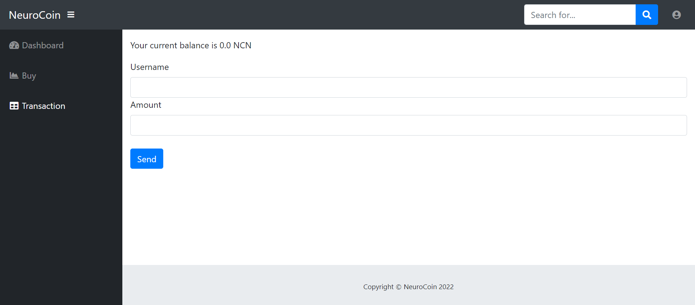

# Welcome to my Blockchain App, Neurocoin!

## 💡 Motivation 

I was interested in learning about blockchain. I went with building the frontend with Flask. I also wanted to start learning about MySQL, so I chose to integrate it with a MySQL database. I learned a lot about Flask routing, PlanetScale and Render, deploying a Flask application, and using SQL and Python. This tutorial by Will Assad was amazing for this project: [Blockchain App Will Assad](https://www.youtube.com/watch?v=b41TVaLwhKc&list=PLtCKS3CuBDYV_Vyl1ZH2Je8gSdXfQf4e3)

Feel free to [reach out](https://abneuro.vercel.app/contact) to me if you have any additional questions. There are lots of features that still need to be implemented!

## Project Structure

- `app.py`: Main application file containing the Flask routes and logic.
- `blockchain.py`: Implementation of the blockchain and related functions.
- `sqlhelpers.py`: Implementation of the SQL functions for managing the blockchain and users database.
- `forms.py`: Implementation of the forms with wtforms.
- `templates/`: Contains HTML templates for rendering pages.
- `static/`: Contains static files like CSS and JavaScript.

## ✨ Pages 

1. **Home Page**:  
 

2. **Register Page**:  
 

3. **Dashboard Page**:  
 

4. **Login Page**:  
 

5. **Buy Page**:  
 

5. **Transaction Page**:  
 

## ⚡️ Technologies 

This site was built using Flask and MySQL. 

The Neurocoin System allows users to manage a blockchain-based ledger of transactions for a token system. Users can register, log in, view their account balance, send tokens to other users, and empty their account.

### Features
- User registration and authentication
- Account balance management
- Sending tokens between users
- Emptying an account
- Blockchain-based ledger for transaction history
- MySQL database integration
- Basic front-end using Flask's templating engine

### Important Dependencies
- Flask
- MySQL Connector
- Passlib
- hashlib

## Future Improvements
1. Deploy to the web. It is difficult to find free and fast options for a MySQL database. PlanetScale sleeps their databases if they are not used often, and Render is extremely slow at deploying my Flask application.

## 👏 Contribute 

Contributions are welcome as always. Before submitting a new pull request, please make sure to open a new issue.

## Getting Started

1. Clone the repository: `git clone https://github.com/abdulolagunju19/blockchain-app.git`
2. Navigate to the project directory: `cd blockchain-app`
3. Install the required dependencies: `pip install -r requirements.txt`
4. Configure your MySQL database settings in the `app.py` file.
5. Start the Flask development server: `python app.py`
6. Access the application in your web browser at port 5000.
